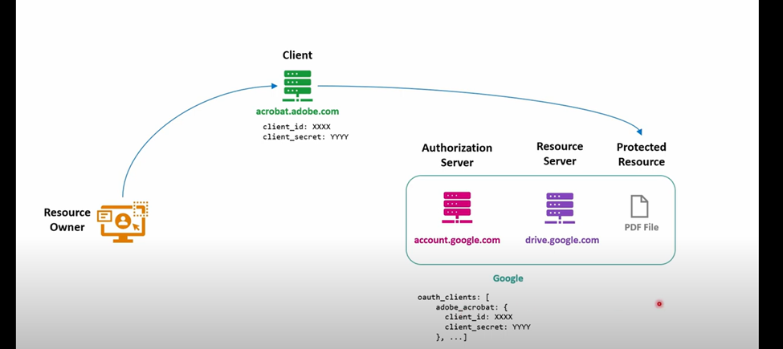
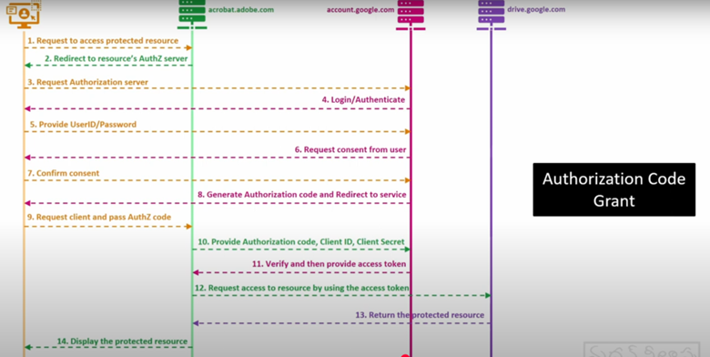
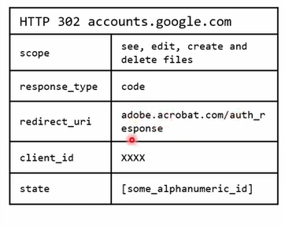
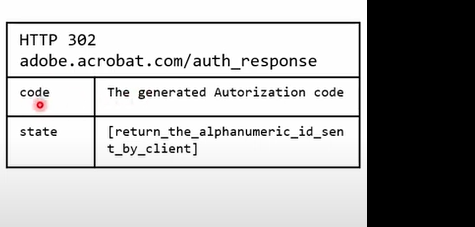
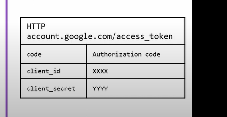
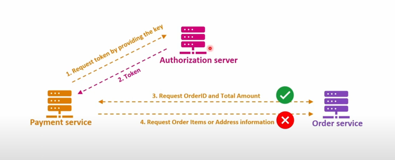
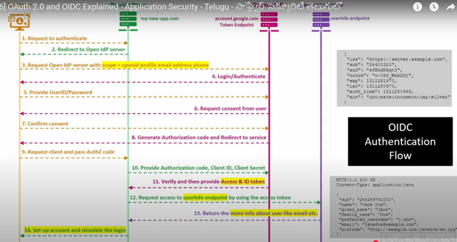

# OAuth2.0 and OpenID Connect

## OAuth2.0 Overview

OAuth2.0 is used for **authorization** — allowing one service to access another service on behalf of the user.

**Example:**  
Editing a PDF stored in Google Drive directly via Adobe Acrobat without manually downloading and uploading the file.

### Key Roles in OAuth
- **Resource Owner:** User who owns the file (You)
- **Resource Server:** Where the file is stored (Google Drive)
- **Authorization Server:** Authenticates and issues tokens (Google Authorization Server)
- **Client:** The application requesting access (Adobe Acrobat)

---

## Authorization Flow (Authorization Code Grant)

1. Resource Owner requests Adobe Acrobat to access the file on Google Drive.
2. Client (Adobe) redirects the user to the Authorization Server with its Client ID and a **state** parameter (used to prevent CSRF attacks).
3. Authorization Server authenticates the Resource Owner.
4. Resource Owner grants consent.
5. Authorization Server issues a short-lived **Authorization Code** to the Resource Owner.
6. The Resource Owner redirects this Authorization Code back to the Client.
7. Client exchanges the Authorization Code for an **Access Token** at the Authorization Server's **Token Endpoint**.
8. Client uses the Access Token to access resources from the Resource Server.
9. Resource Server validates the token and provides the requested resource to the Client's registered redirect URI.

---

## Important HTTP Request & Response Details

When sending the authorization request:

When redirecting back from the Authorization Server:

When exchanging the code for an access token:

---

## Other OAuth Grant Types

- **Authorization Code Grant** (with and without PKCE)
- **Client Credentials Grant** (commonly used in Microservices)
- **Device Code Grant**
- **Refresh Token Grant**
- **Legacy Implicit Flow** (deprecated)
- **Password Grant** (deprecated)

### Example: Client Credentials Grant

A **Payment Service** needs to access an **Order Service** to fetch order details.  
It requests a token from the Authorization Server and uses it to access the resource. Access is restricted based on the scopes defined in the token.

---

## OpenID Connect (OIDC) - Social Sign-On

**OpenID Connect (OIDC)** is built on top of OAuth2.0 for **authentication**.

- OAuth2.0 provides Authorization.
- OIDC provides both Authentication and Authorization.

### Key Differences:

| OAuth2.0 | OpenID Connect (OIDC) |
|---------|-----------------------|
| Authorization protocol | Authentication and Authorization protocol |
| Access Token | ID Token + Access Token |
| Not standardized user info | Standardized UserInfo Endpoint |
| Used for API access | Used for Social Login and API access |

### Roles Mapping in OIDC:
- **Resource Owner** ➔ **End User**
- **Client** ➔ **New Application**
- **Authorization Server** ➔ **Token Endpoint** (provides ID and Access Tokens)
- **Resource Server** ➔ **UserInfo Endpoint** (serves authenticated user data)

OIDC enables **Social Sign-On**, allowing users to log in with providers like Google, Facebook, etc.

---

# Summary

| Feature         | OAuth2.0                   | OpenID Connect (OIDC)       |
|-----------------|-----------------------------|-----------------------------|
| Purpose         | Authorization               | Authentication + Authorization |
| Token           | Access Token                | ID Token + Access Token     |
| User Info       | Not standardized             | Standardized User Info API  |
| Example Usage   | API Access                   | Social Login (Google, Facebook) |

---

# Important Notes

- **State Parameter:** Helps prevent CSRF attacks by matching requests and responses.
- **Access Token:** Used to access protected APIs.
- **ID Token:** Used in OIDC to authenticate users and contains information about the user.
- **Refresh Token:** Allows the client to obtain a new Access Token without re-authenticating the user.

---

Happy Learning! 🚀
